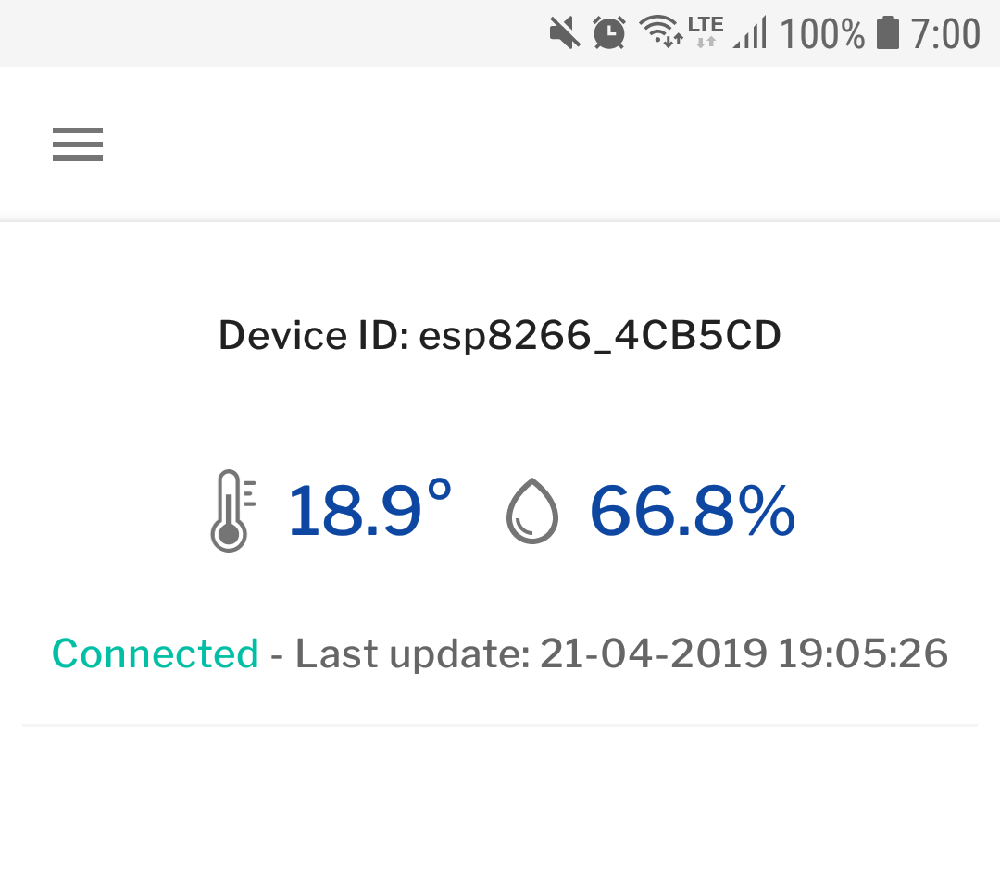

# IoT Google Cloud Weather Station

Example of a weather station using Google Cloud IoT Core, Firebase Cloud Functions, Firestore and AndroidX

- ```firmware```: Mongoose OS development for ESP8266
- ```functions```: Firebase Cloud Functions 
- ```android_app```: Android companion app. Developed using Android Jetpack.

## Hardware system

- DHT22: Temperature and Humidity sensor
- NodeMCU ESP8266
- Breadboard


## Architecture


### Mongoose OS

```mos gcp-iot-setup --gcp-project YOUR_PROJECT_ID --gcp-region europe-west1 --gcp-registry iot-registry```

```mos put fs/init.js```

```javascript
load('api_config.js');
load('api_dht.js');
load('api_mqtt.js');
load('api_timer.js');

let topic = '/devices/' + Cfg.get('device.id') + '/state';
let dht = DHT.create(4, DHT.DHT22);

Timer.set(50000, true, function() {
  let msg = JSON.stringify({ temperature: dht.getTemp(), humidity: dht.getHumidity() });
  let ok = MQTT.pub(topic, msg, 1);
  print(ok, msg);
}, null);
```

## Android App

Developed using Android Jetpack. Firebase & Jetpack
- [x] LiveData
- [x] ViewModel
- [x] Android KTX
- [x] Animation & Transition



## Firebase Cloud Functions

...
