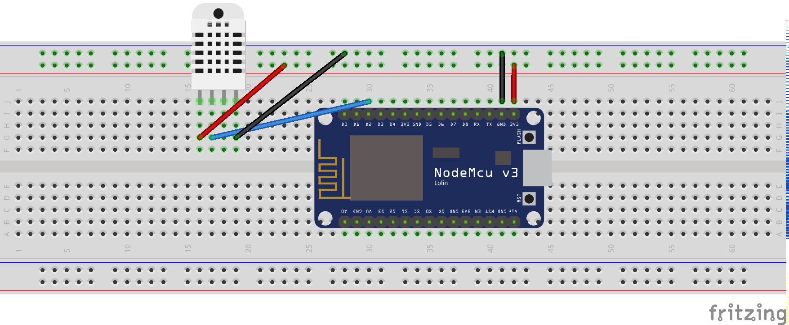

# IoT Google Cloud Weather Station

- ```firmware```: Mongoose OS development for ESP8266
- ```functions```: Firebase Cloud Functions 
- ```android_app```: Android companion app

## Hardware system

- DHT22: Temperature and Humidity sensor
- NodeMCU ESP8266


